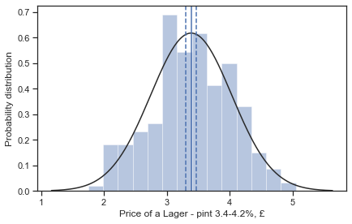
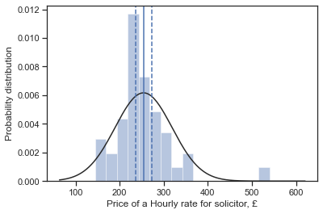
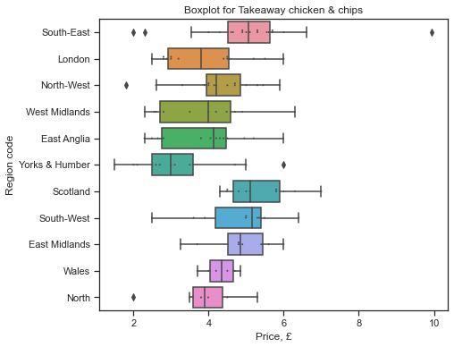
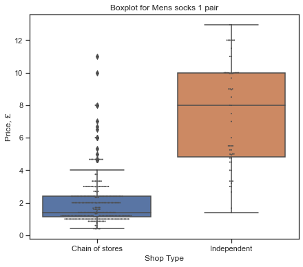
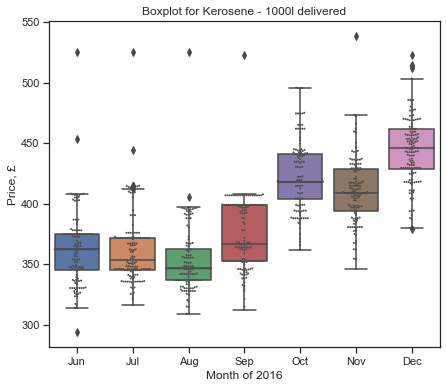

```python
import os
import pandas as pd
```


```python
import numpy as np
import seaborn as sns
import matplotlib.pyplot as plt
from scipy import stats
from ipywidgets import interact
```


```python
os.chdir('D:/Documents/MSc course/MAT002/coursework1')
a = pd.read_csv('price_quote_2017_09.csv')
a.head()
headings = a.columns
```


```python
def region_code(x):
    if x==2:
        return 'London'
    elif x==1:
        return 'Catalogue'
    elif x==3:
        return 'South-East'
    elif x==4:
        return 'South-West'
    elif x==5:
        return 'East Anglia'
    elif x==6:
        return 'East Midlands'
    elif x==7:
        return 'West Midlands'
    elif x==8:
        return 'Yorks & Humber'
    elif x==9:
        return 'North-West'
    elif x==10:
        return 'North'
    elif x==11:
        return 'Wales'
    elif x==12:
        return 'Scotland'
    elif x==13:
        return 'Northern Ireland'
    else:
        return x
    
def shop_code(x):
    if x==1:
        return 'Chain of stores'
    elif x==2:
        return 'Independent'
    else:
        return x

a['REGION'] = a['REGION'].apply(lambda x: region_code(x))
a['SHOP_TYPE'] = a['SHOP_TYPE'].apply(lambda x: shop_code(x))

a.head()
```


<div>
<style scoped>
    .dataframe tbody tr th:only-of-type {
        vertical-align: middle;
    }

    .dataframe tbody tr th {
        vertical-align: top;
    }

    .dataframe thead th {
        text-align: right;
    }
</style>
<table border="1" class="dataframe">
  <thead>
    <tr style="text-align: right;">
      <th></th>
      <th>QUOTE_DATE</th>
      <th>ITEM_ID</th>
      <th>ITEM_DESC</th>
      <th>VALIDITY</th>
      <th>SHOP_CODE</th>
      <th>PRICE</th>
      <th>INDICATOR_BOX</th>
      <th>ORIG_INDICATOR_BOX</th>
      <th>PRICE_RELATIVE</th>
      <th>LOG_PRICE_RELATIVE</th>
      <th>STRATUM_WEIGHT</th>
      <th>STRATUM_TYPE</th>
      <th>START_DATE</th>
      <th>END_DATE</th>
      <th>REGION</th>
      <th>SHOP_TYPE</th>
      <th>SHOP_WEIGHT</th>
      <th>BASE_PRICE</th>
      <th>BASE_VALIDITY</th>
      <th>STRATUM_CELL</th>
    </tr>
  </thead>
  <tbody>
    <tr>
      <th>0</th>
      <td>201709</td>
      <td>210102</td>
      <td>LARGE LOAF-WHITE-UNSLICED-800G</td>
      <td>1</td>
      <td>27</td>
      <td>0.0</td>
      <td>T</td>
      <td>T</td>
      <td>0.0</td>
      <td>0.0</td>
      <td>11.74</td>
      <td>1</td>
      <td>201704</td>
      <td>999999</td>
      <td>North-West</td>
      <td>Chain of stores</td>
      <td>1</td>
      <td>1.02</td>
      <td>4</td>
      <td>9</td>
    </tr>
    <tr>
      <th>1</th>
      <td>201709</td>
      <td>210102</td>
      <td>LARGE LOAF-WHITE-UNSLICED-800G</td>
      <td>1</td>
      <td>40</td>
      <td>0.0</td>
      <td>T</td>
      <td>T</td>
      <td>0.0</td>
      <td>0.0</td>
      <td>12.84</td>
      <td>1</td>
      <td>201702</td>
      <td>999999</td>
      <td>South-East</td>
      <td>Chain of stores</td>
      <td>1</td>
      <td>1.09</td>
      <td>3</td>
      <td>3</td>
    </tr>
    <tr>
      <th>2</th>
      <td>201709</td>
      <td>210102</td>
      <td>LARGE LOAF-WHITE-UNSLICED-800G</td>
      <td>1</td>
      <td>44</td>
      <td>0.0</td>
      <td>T</td>
      <td>T</td>
      <td>0.0</td>
      <td>0.0</td>
      <td>7.60</td>
      <td>1</td>
      <td>201702</td>
      <td>999999</td>
      <td>East Midlands</td>
      <td>Chain of stores</td>
      <td>1</td>
      <td>1.10</td>
      <td>3</td>
      <td>6</td>
    </tr>
    <tr>
      <th>3</th>
      <td>201709</td>
      <td>210102</td>
      <td>LARGE LOAF-WHITE-UNSLICED-800G</td>
      <td>1</td>
      <td>52</td>
      <td>0.0</td>
      <td>M</td>
      <td>M</td>
      <td>0.0</td>
      <td>0.0</td>
      <td>7.60</td>
      <td>1</td>
      <td>201702</td>
      <td>999999</td>
      <td>East Midlands</td>
      <td>Independent</td>
      <td>1</td>
      <td>1.70</td>
      <td>3</td>
      <td>6</td>
    </tr>
    <tr>
      <th>4</th>
      <td>201709</td>
      <td>210102</td>
      <td>LARGE LOAF-WHITE-UNSLICED-800G</td>
      <td>1</td>
      <td>55</td>
      <td>0.0</td>
      <td>T</td>
      <td>T</td>
      <td>0.0</td>
      <td>0.0</td>
      <td>9.05</td>
      <td>1</td>
      <td>201702</td>
      <td>999999</td>
      <td>East Anglia</td>
      <td>Chain of stores</td>
      <td>1</td>
      <td>1.09</td>
      <td>3</td>
      <td>5</td>
    </tr>
  </tbody>
</table>
</div>


```python
a.groupby(by='ITEM_DESC').count()['PRICE'].sort_values(ascending=True)
```


    ITEM_DESC
    PRE-RECORDED DVD (NON-FILM)        44
    COMPUTER GAME TOP 20 CHART         45
    WEEKLY NANNY FEES                  46
    CD ALBUM (NOT CHART)               46
    BLU RAY DISC (FILM) FROM CHART     47
                                     ... 
    MOBILE PHONE ACCESSORY            426
    RESTAURANT CUP OF COFFEE          464
    BOTTLE OF WINE 70-75CL            464
    RESTAURANT - SWEET COURSE         465
    RESTAURANT MAIN COURSE            466
    Name: PRICE, Length: 568, dtype: int64


```python
def confidence_intervals(x):
    result = a[a['ITEM_DESC']==x]
    result = result[result['PRICE']>0]
    
    d = 1.0*np.array(result['PRICE'])
    n = len(d)
    m, se = np.mean(d), stats.sem(d)
    h = se * 2.575
    return m, m-h, m+h
```


```python
def statistical(x):
    plt.clf()
    result = a[a['ITEM_DESC']==x]
    result = result[result['PRICE']>0]
    
    sns.distplot(result['PRICE'],kde=False, fit=stats.norm)
    plt.tight_layout()
    plt.xlabel('Price of a {}, £'.format(str.capitalize(x)))
    plt.ylabel('Probability distribution')
    plt.axvline(confidence_intervals(x)[0])
    plt.axvline(confidence_intervals(x)[1],linestyle='--')
    plt.axvline(confidence_intervals(x)[2],linestyle='--')
    plt.savefig(x+'_normal.png')
    plt.show()
    
    print('Mean price = £{:.2f}'.format(np.mean(result['PRICE'])))
    print('Lower confidence interval = £{:.2f}'.format(confidence_intervals(x)[1]))
    print('Upper confidence interval = £{:.2f}'.format(confidence_intervals(x)[2]))
    print('Number of quotes = {}'.format(len(result)))
    # Shapiro-Wilk test for normality
    print('Shapiro-Wilk test = {}'.format(stats.shapiro(result['PRICE'])))
```


```python
def summarise(x):
    result = a[a['ITEM_DESC']==x]
    result = result[result['PRICE']>0]
    return result['PRICE'].describe()
```


```python
interact(statistical, x=['LAGER - PINT 3.4-4.2%','LIQUEUR PER NIP   SPECIFY ML'])
```

    D:\Anaconda\lib\site-packages\seaborn\distributions.py:2557: FutureWarning: `distplot` is a deprecated function and will be removed in a future version. Please adapt your code to use either `displot` (a figure-level function with similar flexibility) or `histplot` (an axes-level function for histograms).
      warnings.warn(msg, FutureWarning)
    


    

    


    Mean price = £3.39
    Lower confidence interval = £3.30
    Upper confidence interval = £3.47
    Number of quotes = 399
    Shapiro-Wilk test = ShapiroResult(statistic=0.9917417764663696, pvalue=0.025665421038866043)
    


    <function __main__.statistical(x)>


```python
summarise("HOME KILLED BEEF-LEAN MINCE KG")
```


    count    271.000000
    mean       7.476568
    std        2.064686
    min        2.900000
    25%        6.180000
    50%        7.490000
    75%        8.780000
    max       13.980000
    Name: PRICE, dtype: float64


Test normality for all products


```python
S_W_tests = []

for i in pd.unique(a['ITEM_DESC']):

    result = a[a['ITEM_DESC']==i]
    result = result[result['PRICE']>0]
    
    # Looking at all ANOVA values
    S_W_tests.append((i,stats.shapiro(result['PRICE'])[0],stats.shapiro(result['PRICE'])[1]))
    
Swilk_stats = pd.DataFrame(S_W_tests,columns=['Item','T_Cr','p_val'])
Swilk_stats[['Item','T_Cr','p_val']].sort_values(by='p_val',ascending=True)
```


<div>
<style scoped>
    .dataframe tbody tr th:only-of-type {
        vertical-align: middle;
    }

    .dataframe tbody tr th {
        vertical-align: top;
    }

    .dataframe thead th {
        text-align: right;
    }
</style>
<table border="1" class="dataframe">
  <thead>
    <tr style="text-align: right;">
      <th></th>
      <th>Item</th>
      <th>T_Cr</th>
      <th>p_val</th>
    </tr>
  </thead>
  <tbody>
    <tr>
      <th>394</th>
      <td>WOMENS LEGGINGS FULL LENGTH</td>
      <td>0.359945</td>
      <td>7.055836e-33</td>
    </tr>
    <tr>
      <th>381</th>
      <td>WOMEN'S SKIRT: CASUAL</td>
      <td>0.461539</td>
      <td>2.500297e-31</td>
    </tr>
    <tr>
      <th>378</th>
      <td>WOMEN'S CARDIGAN</td>
      <td>0.449883</td>
      <td>4.000081e-31</td>
    </tr>
    <tr>
      <th>383</th>
      <td>WOMEN'S VEST/STRAPPY TOP</td>
      <td>0.425545</td>
      <td>4.382403e-31</td>
    </tr>
    <tr>
      <th>407</th>
      <td>WOMEN'S NIGHTDRESS/PYJAMAS</td>
      <td>0.451221</td>
      <td>5.599286e-31</td>
    </tr>
    <tr>
      <th>...</th>
      <td>...</td>
      <td>...</td>
      <td>...</td>
    </tr>
    <tr>
      <th>445</th>
      <td>DAILY DISPOSABLE SOFT LENSES</td>
      <td>0.984098</td>
      <td>9.940200e-02</td>
    </tr>
    <tr>
      <th>347</th>
      <td>HOME CARE ASSISTANT HRLY RATE</td>
      <td>0.981416</td>
      <td>1.663436e-01</td>
    </tr>
    <tr>
      <th>494</th>
      <td>CAR REPAIRS LOCAL GARAGE</td>
      <td>0.984871</td>
      <td>2.340499e-01</td>
    </tr>
    <tr>
      <th>199</th>
      <td>DRAUGHT STOUT PER PINT</td>
      <td>0.995732</td>
      <td>3.606236e-01</td>
    </tr>
    <tr>
      <th>344</th>
      <td>HOME REMOVAL- 1 VAN</td>
      <td>0.990274</td>
      <td>6.221716e-01</td>
    </tr>
  </tbody>
</table>
<p>568 rows × 3 columns</p>
</div>


Wilcoxon signed rank stat


```python
def wilcoxon(x):
    plt.clf()
    result = a[a['ITEM_DESC']==x]
    result = result[result['PRICE']>0]
    N = len(result)
    
    sns.distplot(result['PRICE'],kde=False, fit=stats.norm)
    plt.xlabel('Price of a {}, £'.format(str.capitalize(x)))
    plt.ylabel('Probability distribution')
    plt.axvline(confidence_intervals(x)[0])
    plt.axvline(confidence_intervals(x)[1],linestyle='--')
    plt.axvline(confidence_intervals(x)[2],linestyle='--')
    plt.show()
    
    print('Mean price = £{:.2f}'.format(np.mean(result['PRICE'])))
    print('Median price = £{:.2f}'.format(np.median(result['PRICE'])))
    print('Lower confidence interval (normal approx.) = £{:.2f}'.format(confidence_intervals(x)[1]))
    print('Upper confidence interval (normal approx.) = £{:.2f}'.format(confidence_intervals(x)[2]))
    # Shapiro-Wilk test for normality
    print('Shapiro-Wilk test = {}'.format(stats.shapiro(result['PRICE'])))
    print('Sample size = {}'.format(len(result['PRICE'])))
    
    #Wilcoxon signed-rank test
    test, p_val = stats.wilcoxon(x=np.median(result['PRICE'])*np.ones(shape=(N)), y=result['PRICE'])
    print('Wilcoxon Test stat = {}'.format(test))
    print('Wilcoxon P_value = {}'.format(p_val))
    
    confidence = []
    for i in np.linspace(np.median(result['PRICE'])*1, np.median(result['PRICE'])*1.5, num=66):
        p_val = stats.wilcoxon(x=i*np.ones(shape=(N)), y=result['PRICE'])[1]
        confidence.append((i,p_val))
    wilcoxon = pd.DataFrame(confidence,columns=['Medians','p_val'])
    return wilcoxon
```


```python
wilcoxon("HOURLY RATE FOR SOLICITOR")
```

    D:\Anaconda\lib\site-packages\seaborn\distributions.py:2557: FutureWarning: `distplot` is a deprecated function and will be removed in a future version. Please adapt your code to use either `displot` (a figure-level function with similar flexibility) or `histplot` (an axes-level function for histograms).
      warnings.warn(msg, FutureWarning)
    


    

    


    Mean price = £254.09
    Median price = £240.00
    Lower confidence interval (normal approx.) = £235.69
    Upper confidence interval (normal approx.) = £272.49
    Shapiro-Wilk test = ShapiroResult(statistic=0.8421726226806641, pvalue=5.8617789733261816e-08)
    Sample size = 83
    Wilcoxon Test stat = 986.5
    Wilcoxon P_value = 0.09462102392757735
    


<div>
<style scoped>
    .dataframe tbody tr th:only-of-type {
        vertical-align: middle;
    }

    .dataframe tbody tr th {
        vertical-align: top;
    }

    .dataframe thead th {
        text-align: right;
    }
</style>
<table border="1" class="dataframe">
  <thead>
    <tr style="text-align: right;">
      <th></th>
      <th>Medians</th>
      <th>p_val</th>
    </tr>
  </thead>
  <tbody>
    <tr>
      <th>0</th>
      <td>240.000000</td>
      <td>9.462102e-02</td>
    </tr>
    <tr>
      <th>1</th>
      <td>241.846154</td>
      <td>2.393837e-01</td>
    </tr>
    <tr>
      <th>2</th>
      <td>243.692308</td>
      <td>3.660094e-01</td>
    </tr>
    <tr>
      <th>3</th>
      <td>245.538462</td>
      <td>4.161481e-01</td>
    </tr>
    <tr>
      <th>4</th>
      <td>247.384615</td>
      <td>8.167931e-01</td>
    </tr>
    <tr>
      <th>...</th>
      <td>...</td>
      <td>...</td>
    </tr>
    <tr>
      <th>61</th>
      <td>352.615385</td>
      <td>7.855655e-13</td>
    </tr>
    <tr>
      <th>62</th>
      <td>354.461538</td>
      <td>5.633270e-13</td>
    </tr>
    <tr>
      <th>63</th>
      <td>356.307692</td>
      <td>5.633270e-13</td>
    </tr>
    <tr>
      <th>64</th>
      <td>358.153846</td>
      <td>5.269514e-13</td>
    </tr>
    <tr>
      <th>65</th>
      <td>360.000000</td>
      <td>6.677325e-13</td>
    </tr>
  </tbody>
</table>
<p>66 rows × 2 columns</p>
</div>


```python
def regional_chart(x):
    plt.clf()
    result = a[a['ITEM_DESC']==x]
    result = result[result['PRICE']>0]
    result = result[result['REGION']!='Northern Ireland']
    
    g = result.groupby('REGION')
    
    sns.set(style="ticks")

    # Initialize the figure
    f, ax = plt.subplots(figsize=(7, 6))
    
    sns.boxplot(y="REGION", x="PRICE", data=result)
    sns.swarmplot(y="REGION", x="PRICE", data=result, size=2, color='.3')
    # Add in points to show each observation
    
    plt.title('Boxplot for {}'.format(str.capitalize(x)))
    plt.ylabel('Region code')
    plt.xlabel('Price, £')
    plt.savefig(x+'_regional.png')
    plt.show()
    
    print(g['PRICE'].mean())
    
    # ANOVA
    
    samples = [np.array(x[1]['PRICE']) for x in g]
    f_val, p_val = stats.kruskal(*samples)
    print('F value: {:.3f}, p value: {:.3f}'.format(f_val, p_val))
```


```python
regional_chart('TAKEAWAY CHICKEN & CHIPS')
```


    <Figure size 432x288 with 0 Axes>


    

    


    REGION
    East Anglia       3.883571
    East Midlands     4.806250
    London            3.916429
    North             3.846667
    North-West        4.232667
    Scotland          5.371818
    South-East        5.050000
    South-West        4.793000
    Wales             4.325000
    West Midlands     3.848182
    Yorks & Humber    3.253077
    Name: PRICE, dtype: float64
    F value: 30.428, p value: 0.001
    


```python
F_Stats = []

for i in pd.unique(a['ITEM_DESC']):

    result = a[a['ITEM_DESC']==i]
    result = result[result['PRICE']>0]
    
    # Looking at all ANOVA values
    g = result.groupby('REGION')
    samples = [np.array(x[1]['PRICE']) for x in g]
    f_val, p_val = stats.kruskal(*samples)
    
    F_Stats.append((i,f_val,p_val))

F_Stats = pd.DataFrame(F_Stats,columns=['Item','f_val','p_val'])
```


```python
F_Stats.sort_values(by='p_val',ascending=False).head(n=30)
```


<div>
<style scoped>
    .dataframe tbody tr th:only-of-type {
        vertical-align: middle;
    }

    .dataframe tbody tr th {
        vertical-align: top;
    }

    .dataframe thead th {
        text-align: right;
    }
</style>
<table border="1" class="dataframe">
  <thead>
    <tr style="text-align: right;">
      <th></th>
      <th>Item</th>
      <th>f_val</th>
      <th>p_val</th>
    </tr>
  </thead>
  <tbody>
    <tr>
      <th>144</th>
      <td>MELON EACH EG HONEYDEW</td>
      <td>1.238678</td>
      <td>0.999852</td>
    </tr>
    <tr>
      <th>512</th>
      <td>MP4 PLAYER</td>
      <td>1.591143</td>
      <td>0.999821</td>
    </tr>
    <tr>
      <th>221</th>
      <td>VODKA-70 CL BOTTLE</td>
      <td>1.342292</td>
      <td>0.999780</td>
    </tr>
    <tr>
      <th>311</th>
      <td>WASHING UP LIQUID 380-900ML</td>
      <td>1.372081</td>
      <td>0.999754</td>
    </tr>
    <tr>
      <th>122</th>
      <td>VEGETABLE STIR FRY FRESH PACK</td>
      <td>1.467171</td>
      <td>0.999659</td>
    </tr>
    <tr>
      <th>118</th>
      <td>PRE-PACKED SALAD 100-250G</td>
      <td>1.574546</td>
      <td>0.999518</td>
    </tr>
    <tr>
      <th>123</th>
      <td>SWEET POTATO PER KG</td>
      <td>1.672965</td>
      <td>0.999355</td>
    </tr>
    <tr>
      <th>6</th>
      <td>DRY SPAGHETTI OR PASTA 500G</td>
      <td>1.895951</td>
      <td>0.998830</td>
    </tr>
    <tr>
      <th>207</th>
      <td>LAGER 12 - 24 CANS (440-500ML)</td>
      <td>2.017262</td>
      <td>0.998434</td>
    </tr>
    <tr>
      <th>384</th>
      <td>WOMENS DRESS -CASUAL/FORMAL</td>
      <td>2.521025</td>
      <td>0.998084</td>
    </tr>
    <tr>
      <th>196</th>
      <td>VENDING MACHINE - SOFT DRINK</td>
      <td>2.208762</td>
      <td>0.997618</td>
    </tr>
    <tr>
      <th>77</th>
      <td>TEA BAGS-2-PACKET OF 240</td>
      <td>2.227370</td>
      <td>0.997524</td>
    </tr>
    <tr>
      <th>206</th>
      <td>LAGER 4 BOTTLES- PREMIUM</td>
      <td>2.254285</td>
      <td>0.997384</td>
    </tr>
    <tr>
      <th>143</th>
      <td>FRUIT FRESH SNACKING 150-350G</td>
      <td>2.329299</td>
      <td>0.996964</td>
    </tr>
    <tr>
      <th>92</th>
      <td>SUGAR -GRANULATED-WHITE-PER KG</td>
      <td>2.422104</td>
      <td>0.996377</td>
    </tr>
    <tr>
      <th>142</th>
      <td>BLUEBERRIES PUNNET PER KG</td>
      <td>2.471917</td>
      <td>0.996030</td>
    </tr>
    <tr>
      <th>12</th>
      <td>HOT OAT CEREAL</td>
      <td>2.482888</td>
      <td>0.995951</td>
    </tr>
    <tr>
      <th>501</th>
      <td>PUSHCHAIR/STROLLER</td>
      <td>2.513757</td>
      <td>0.995720</td>
    </tr>
    <tr>
      <th>124</th>
      <td>CANNED TOMATOES 390-400G</td>
      <td>2.685467</td>
      <td>0.994264</td>
    </tr>
    <tr>
      <th>539</th>
      <td>PORTABLE DIGITAL STORAGE DEVIC</td>
      <td>2.697006</td>
      <td>0.994155</td>
    </tr>
    <tr>
      <th>150</th>
      <td>CANNED SOUP-390-425G</td>
      <td>2.746030</td>
      <td>0.993674</td>
    </tr>
    <tr>
      <th>20</th>
      <td>BISCUITS HALF CHOC 260-400G</td>
      <td>2.961517</td>
      <td>0.991225</td>
    </tr>
    <tr>
      <th>166</th>
      <td>COFFEE PODS PACK 8-16</td>
      <td>3.131089</td>
      <td>0.988877</td>
    </tr>
    <tr>
      <th>447</th>
      <td>MOBILE PHONE ACCESSORY</td>
      <td>3.712922</td>
      <td>0.988077</td>
    </tr>
    <tr>
      <th>516</th>
      <td>FLAT PANEL TV 14-22"/35-55CM</td>
      <td>3.830246</td>
      <td>0.986308</td>
    </tr>
    <tr>
      <th>43</th>
      <td>CONTINENTAL SLICED DELI MEAT</td>
      <td>3.292838</td>
      <td>0.986262</td>
    </tr>
    <tr>
      <th>161</th>
      <td>CHILLED PIZZA EACH 300-600G</td>
      <td>3.431301</td>
      <td>0.983712</td>
    </tr>
    <tr>
      <th>78</th>
      <td>FRUIT SQUASH, 750ML - 1.5LT</td>
      <td>3.453652</td>
      <td>0.983272</td>
    </tr>
    <tr>
      <th>45</th>
      <td>CHICKEN KIEV 2 PACK 240-310G</td>
      <td>3.485812</td>
      <td>0.982626</td>
    </tr>
    <tr>
      <th>158</th>
      <td>CHILLED READY MEAL-MEAT-SERVS1</td>
      <td>3.530037</td>
      <td>0.981709</td>
    </tr>
  </tbody>
</table>
</div>


```python
len(F_Stats[F_Stats['p_val']<0.05])
```


    106


```python
shoptype_chart('MENS SOCKS 1 PAIR')
```


    

    


    SHOP_TYPE
    Chain of stores    2.013203
    Independent        7.511379
    Name: PRICE, dtype: float64
    Shapiro-Wilk test = [ShapiroResult(statistic=0.7307813167572021, pvalue=4.8377427903997244e-21), ShapiroResult(statistic=0.9316719770431519, pvalue=0.0028513146098703146)]
    Variances = [2.1291349375008, 10.721570511296076]
    F value: 401.414, p value: 0.000
    


```python
F_Stats = []

for i in pd.unique(a['ITEM_DESC']):

    result = a[a['ITEM_DESC']==i]
    result = result[result['PRICE']>0]
    
    # Looking at all ANOVA values
    g = result.groupby('SHOP_TYPE')
    samples = [x[1]['PRICE'] for x in g]
    
    if len(samples)>1:
        f_val, p_val = stats.f_oneway(*samples)

        F_Stats.append((i,f_val,p_val))

F_Stats = pd.DataFrame(F_Stats,columns=['Item','f_val','p_val'])
```


```python
F_Stats.sort_values(by='p_val',ascending=True)
```


<div>
<style scoped>
    .dataframe tbody tr th:only-of-type {
        vertical-align: middle;
    }

    .dataframe tbody tr th {
        vertical-align: top;
    }

    .dataframe thead th {
        text-align: right;
    }
</style>
<table border="1" class="dataframe">
  <thead>
    <tr style="text-align: right;">
      <th></th>
      <th>Item</th>
      <th>f_val</th>
      <th>p_val</th>
    </tr>
  </thead>
  <tbody>
    <tr>
      <th>381</th>
      <td>MENS SOCKS 1 PAIR</td>
      <td>433.884824</td>
      <td>2.628217e-63</td>
    </tr>
    <tr>
      <th>120</th>
      <td>BANANAS-PER KG</td>
      <td>520.131653</td>
      <td>3.259348e-63</td>
    </tr>
    <tr>
      <th>99</th>
      <td>FRESH VEG-CUCUMBER-WHOLE</td>
      <td>416.019414</td>
      <td>2.653576e-57</td>
    </tr>
    <tr>
      <th>100</th>
      <td>FRESH VEG-LETTUCE-ICEBERG-EACH</td>
      <td>362.404638</td>
      <td>1.065520e-51</td>
    </tr>
    <tr>
      <th>327</th>
      <td>MENS JEANS</td>
      <td>238.177930</td>
      <td>1.581973e-41</td>
    </tr>
    <tr>
      <th>...</th>
      <td>...</td>
      <td>...</td>
      <td>...</td>
    </tr>
    <tr>
      <th>138</th>
      <td>DRIED POTTED SNACK 50-120G</td>
      <td>0.005652</td>
      <td>9.401826e-01</td>
    </tr>
    <tr>
      <th>322</th>
      <td>FUNERAL-CREMATION</td>
      <td>0.001149</td>
      <td>9.729816e-01</td>
    </tr>
    <tr>
      <th>24</th>
      <td>FROZEN BEEFBURGERS PACK OF 4</td>
      <td>0.000132</td>
      <td>9.908450e-01</td>
    </tr>
    <tr>
      <th>449</th>
      <td>NON-NHS MEDICINE-PHYSIOTHERAPY</td>
      <td>0.000115</td>
      <td>9.914533e-01</td>
    </tr>
    <tr>
      <th>263</th>
      <td>ELECTRIC COOKER</td>
      <td>0.000028</td>
      <td>9.958069e-01</td>
    </tr>
  </tbody>
</table>
<p>523 rows × 3 columns</p>
</div>


# Seasonal trends


```python
b = pd.concat(pd.read_csv(i,names=headings,skiprows=1) for i in os.listdir() if i.startswith('upload'))
b.head()
```


<div>
<style scoped>
    .dataframe tbody tr th:only-of-type {
        vertical-align: middle;
    }

    .dataframe tbody tr th {
        vertical-align: top;
    }

    .dataframe thead th {
        text-align: right;
    }
</style>
<table border="1" class="dataframe">
  <thead>
    <tr style="text-align: right;">
      <th></th>
      <th>QUOTE_DATE</th>
      <th>ITEM_ID</th>
      <th>ITEM_DESC</th>
      <th>VALIDITY</th>
      <th>SHOP_CODE</th>
      <th>PRICE</th>
      <th>INDICATOR_BOX</th>
      <th>ORIG_INDICATOR_BOX</th>
      <th>PRICE_RELATIVE</th>
      <th>LOG_PRICE_RELATIVE</th>
      <th>STRATUM_WEIGHT</th>
      <th>STRATUM_TYPE</th>
      <th>START_DATE</th>
      <th>END_DATE</th>
      <th>REGION</th>
      <th>SHOP_TYPE</th>
      <th>SHOP_WEIGHT</th>
      <th>BASE_PRICE</th>
      <th>BASE_VALIDITY</th>
      <th>STRATUM_CELL</th>
    </tr>
  </thead>
  <tbody>
    <tr>
      <th>0</th>
      <td>201601</td>
      <td>210102</td>
      <td>LARGE LOAF-WHITE-UNSLICED-800G</td>
      <td>1</td>
      <td>21</td>
      <td>0.0</td>
      <td>T</td>
      <td>T</td>
      <td>0.0</td>
      <td>0.0</td>
      <td>8.21</td>
      <td>1</td>
      <td>201502</td>
      <td>999999</td>
      <td>8</td>
      <td>1</td>
      <td>1</td>
      <td>1.390</td>
      <td>3</td>
      <td>8</td>
    </tr>
    <tr>
      <th>1</th>
      <td>201601</td>
      <td>210102</td>
      <td>LARGE LOAF-WHITE-UNSLICED-800G</td>
      <td>1</td>
      <td>27</td>
      <td>0.0</td>
      <td>T</td>
      <td>T</td>
      <td>0.0</td>
      <td>0.0</td>
      <td>11.57</td>
      <td>1</td>
      <td>201504</td>
      <td>999999</td>
      <td>9</td>
      <td>1</td>
      <td>1</td>
      <td>1.383</td>
      <td>4</td>
      <td>9</td>
    </tr>
    <tr>
      <th>2</th>
      <td>201601</td>
      <td>210102</td>
      <td>LARGE LOAF-WHITE-UNSLICED-800G</td>
      <td>1</td>
      <td>40</td>
      <td>0.0</td>
      <td>T</td>
      <td>T</td>
      <td>0.0</td>
      <td>0.0</td>
      <td>8.21</td>
      <td>1</td>
      <td>201502</td>
      <td>999999</td>
      <td>8</td>
      <td>1</td>
      <td>1</td>
      <td>1.390</td>
      <td>3</td>
      <td>8</td>
    </tr>
    <tr>
      <th>3</th>
      <td>201601</td>
      <td>210102</td>
      <td>LARGE LOAF-WHITE-UNSLICED-800G</td>
      <td>1</td>
      <td>43</td>
      <td>0.0</td>
      <td>M</td>
      <td>M</td>
      <td>0.0</td>
      <td>0.0</td>
      <td>10.73</td>
      <td>1</td>
      <td>201502</td>
      <td>999999</td>
      <td>2</td>
      <td>1</td>
      <td>1</td>
      <td>3.690</td>
      <td>3</td>
      <td>2</td>
    </tr>
    <tr>
      <th>4</th>
      <td>201601</td>
      <td>210102</td>
      <td>LARGE LOAF-WHITE-UNSLICED-800G</td>
      <td>1</td>
      <td>47</td>
      <td>0.0</td>
      <td>T</td>
      <td>T</td>
      <td>0.0</td>
      <td>0.0</td>
      <td>8.21</td>
      <td>1</td>
      <td>201502</td>
      <td>999999</td>
      <td>8</td>
      <td>1</td>
      <td>1</td>
      <td>1.390</td>
      <td>3</td>
      <td>8</td>
    </tr>
  </tbody>
</table>
</div>


```python
import datetime as dt
b['QUOTE_DATE'] = b['QUOTE_DATE'].apply(lambda x: dt.datetime.strftime(dt.datetime.strptime(str(x)[-2:],'%m'),'%b'))
b.head()
```


<div>
<style scoped>
    .dataframe tbody tr th:only-of-type {
        vertical-align: middle;
    }

    .dataframe tbody tr th {
        vertical-align: top;
    }

    .dataframe thead th {
        text-align: right;
    }
</style>
<table border="1" class="dataframe">
  <thead>
    <tr style="text-align: right;">
      <th></th>
      <th>QUOTE_DATE</th>
      <th>ITEM_ID</th>
      <th>ITEM_DESC</th>
      <th>VALIDITY</th>
      <th>SHOP_CODE</th>
      <th>PRICE</th>
      <th>INDICATOR_BOX</th>
      <th>ORIG_INDICATOR_BOX</th>
      <th>PRICE_RELATIVE</th>
      <th>LOG_PRICE_RELATIVE</th>
      <th>STRATUM_WEIGHT</th>
      <th>STRATUM_TYPE</th>
      <th>START_DATE</th>
      <th>END_DATE</th>
      <th>REGION</th>
      <th>SHOP_TYPE</th>
      <th>SHOP_WEIGHT</th>
      <th>BASE_PRICE</th>
      <th>BASE_VALIDITY</th>
      <th>STRATUM_CELL</th>
    </tr>
  </thead>
  <tbody>
    <tr>
      <th>0</th>
      <td>Jan</td>
      <td>210102</td>
      <td>LARGE LOAF-WHITE-UNSLICED-800G</td>
      <td>1</td>
      <td>21</td>
      <td>0.0</td>
      <td>T</td>
      <td>T</td>
      <td>0.0</td>
      <td>0.0</td>
      <td>8.21</td>
      <td>1</td>
      <td>201502</td>
      <td>999999</td>
      <td>8</td>
      <td>1</td>
      <td>1</td>
      <td>1.390</td>
      <td>3</td>
      <td>8</td>
    </tr>
    <tr>
      <th>1</th>
      <td>Jan</td>
      <td>210102</td>
      <td>LARGE LOAF-WHITE-UNSLICED-800G</td>
      <td>1</td>
      <td>27</td>
      <td>0.0</td>
      <td>T</td>
      <td>T</td>
      <td>0.0</td>
      <td>0.0</td>
      <td>11.57</td>
      <td>1</td>
      <td>201504</td>
      <td>999999</td>
      <td>9</td>
      <td>1</td>
      <td>1</td>
      <td>1.383</td>
      <td>4</td>
      <td>9</td>
    </tr>
    <tr>
      <th>2</th>
      <td>Jan</td>
      <td>210102</td>
      <td>LARGE LOAF-WHITE-UNSLICED-800G</td>
      <td>1</td>
      <td>40</td>
      <td>0.0</td>
      <td>T</td>
      <td>T</td>
      <td>0.0</td>
      <td>0.0</td>
      <td>8.21</td>
      <td>1</td>
      <td>201502</td>
      <td>999999</td>
      <td>8</td>
      <td>1</td>
      <td>1</td>
      <td>1.390</td>
      <td>3</td>
      <td>8</td>
    </tr>
    <tr>
      <th>3</th>
      <td>Jan</td>
      <td>210102</td>
      <td>LARGE LOAF-WHITE-UNSLICED-800G</td>
      <td>1</td>
      <td>43</td>
      <td>0.0</td>
      <td>M</td>
      <td>M</td>
      <td>0.0</td>
      <td>0.0</td>
      <td>10.73</td>
      <td>1</td>
      <td>201502</td>
      <td>999999</td>
      <td>2</td>
      <td>1</td>
      <td>1</td>
      <td>3.690</td>
      <td>3</td>
      <td>2</td>
    </tr>
    <tr>
      <th>4</th>
      <td>Jan</td>
      <td>210102</td>
      <td>LARGE LOAF-WHITE-UNSLICED-800G</td>
      <td>1</td>
      <td>47</td>
      <td>0.0</td>
      <td>T</td>
      <td>T</td>
      <td>0.0</td>
      <td>0.0</td>
      <td>8.21</td>
      <td>1</td>
      <td>201502</td>
      <td>999999</td>
      <td>8</td>
      <td>1</td>
      <td>1</td>
      <td>1.390</td>
      <td>3</td>
      <td>8</td>
    </tr>
  </tbody>
</table>
</div>


```python
def seasonal_analysis(x):
    
    plt.clf()
    
    result = b[b['ITEM_DESC']==x]
    result = result[result['PRICE']>0]
    
    # Initialize the figure
    f, ax = plt.subplots(figsize=(7, 6))
    
    sns.boxplot(y="PRICE", x="QUOTE_DATE", data=result)
    sns.swarmplot(y="PRICE", x="QUOTE_DATE", data=result, size=2, color='.3')
    # Add in points to show each observation
    
    plt.title('Boxplot for {}'.format(str.capitalize(x)))
    plt.ylabel('Price, £')
    plt.xlabel('Month of 2016')

    plt.show()

    g = result.groupby('QUOTE_DATE')
    
    # ANOVA
    
    samples = [np.array(x[1]['PRICE']) for x in g]
    
    # Look at min length of array

    minimum_sample = np.min([len(i) for i in samples])

    # Randomly remove

    samples = [np.random.choice(i,minimum_sample) for i in samples]
    
    #Friedman
    f_val, p_val = stats.friedmanchisquare(*samples)
    print('F value: {:.3f}, p value: {:.3f}'.format(f_val, p_val))
    
    print(g['PRICE'].mean())
```


```python
seasonal_analysis("""KEROSENE - 1000L DELIVERED""")
```

    D:\Anaconda\lib\site-packages\seaborn\categorical.py:1296: UserWarning: 5.3% of the points cannot be placed; you may want to decrease the size of the markers or use stripplot.
      warnings.warn(msg, UserWarning)
    


    <Figure size 432x288 with 0 Axes>


    

    


    F value: 506.239, p value: 0.000
    QUOTE_DATE
    Aug    353.054436
    Dec    444.412647
    Jul    362.422985
    Jun    361.453603
    Nov    410.575344
    Oct    423.470534
    Sep    373.458947
    Name: PRICE, dtype: float64
    


```python
F_Stats = []

for i in pd.unique(b['ITEM_DESC']):

    try:
        result = b[b['ITEM_DESC']==i]
        result = result[result['PRICE']>0]

        # Looking at all ANOVA values
        g = result.groupby('QUOTE_DATE')
        samples = [np.array(x[1]['PRICE']) for x in g]

        minimum_sample = np.min([len(i) for i in samples])

        samples = [np.random.choice(i,minimum_sample) for i in samples]

        f_val, p_val = stats.friedmanchisquare(*samples)

        F_Stats.append((i,f_val,p_val))
    
    except ValueError:
        pass
    
F_Stats = pd.DataFrame(F_Stats,columns=['Item','f_val','p_val'])
```


```python
F_Stats.sort_values(by='p_val',ascending=True).head(n=20)
```


<div>
<style scoped>
    .dataframe tbody tr th:only-of-type {
        vertical-align: middle;
    }

    .dataframe tbody tr th {
        vertical-align: top;
    }

    .dataframe thead th {
        text-align: right;
    }
</style>
<table border="1" class="dataframe">
  <thead>
    <tr style="text-align: right;">
      <th></th>
      <th>Item</th>
      <th>f_val</th>
      <th>p_val</th>
    </tr>
  </thead>
  <tbody>
    <tr>
      <th>797</th>
      <td>KEROSENE - 1000L DELIVERED</td>
      <td>489.183690</td>
      <td>1.796869e-102</td>
    </tr>
    <tr>
      <th>773</th>
      <td>CIGARETTES 8</td>
      <td>275.162429</td>
      <td>1.704665e-56</td>
    </tr>
    <tr>
      <th>774</th>
      <td>CIGARETTES 12</td>
      <td>262.858948</td>
      <td>7.309182e-54</td>
    </tr>
    <tr>
      <th>776</th>
      <td>CIGARETTES 20</td>
      <td>190.898758</td>
      <td>1.638615e-38</td>
    </tr>
    <tr>
      <th>696</th>
      <td>MELON EACH EG HONEYDEW</td>
      <td>190.897378</td>
      <td>1.639723e-38</td>
    </tr>
    <tr>
      <th>777</th>
      <td>20 FILTER - OTHER BRAND</td>
      <td>176.844801</td>
      <td>1.586925e-35</td>
    </tr>
    <tr>
      <th>248</th>
      <td>KEROSENE - 1000L DELIVERED</td>
      <td>161.686728</td>
      <td>6.355599e-34</td>
    </tr>
    <tr>
      <th>224</th>
      <td>CIGARETTES 15</td>
      <td>158.588658</td>
      <td>2.934914e-33</td>
    </tr>
    <tr>
      <th>223</th>
      <td>CIGARETTES 12</td>
      <td>146.348930</td>
      <td>1.233071e-30</td>
    </tr>
    <tr>
      <th>775</th>
      <td>CIGARETTES 15</td>
      <td>145.038354</td>
      <td>8.653131e-29</td>
    </tr>
    <tr>
      <th>640</th>
      <td>FRUIT SQUASH, 750ML - 1.5LT</td>
      <td>142.873813</td>
      <td>2.479238e-28</td>
    </tr>
    <tr>
      <th>772</th>
      <td>CREAM LIQUER 70CL-1LT 15-20%</td>
      <td>129.107768</td>
      <td>1.980945e-25</td>
    </tr>
    <tr>
      <th>222</th>
      <td>CIGARETTES 8</td>
      <td>110.434229</td>
      <td>5.880041e-23</td>
    </tr>
    <tr>
      <th>54</th>
      <td>MARGARINE/LOW FAT SPREAD-500G</td>
      <td>107.834221</td>
      <td>2.107678e-22</td>
    </tr>
    <tr>
      <th>519</th>
      <td>BOOK-NON-FICTION-HARD-COVER</td>
      <td>107.336637</td>
      <td>2.690798e-22</td>
    </tr>
    <tr>
      <th>624</th>
      <td>MARGARINE/LOW FAT SPREAD-500G</td>
      <td>110.484277</td>
      <td>1.613894e-21</td>
    </tr>
    <tr>
      <th>132</th>
      <td>SMALL TYPE ORANGES PER PACK/KG</td>
      <td>124.607429</td>
      <td>2.139395e-21</td>
    </tr>
    <tr>
      <th>1037</th>
      <td>BOOK-NON-FICTION-PAPER-BACK</td>
      <td>103.550608</td>
      <td>4.552591e-20</td>
    </tr>
    <tr>
      <th>82</th>
      <td>PURE FRUIT SMOOTHIE 750ML-1LTR</td>
      <td>111.502231</td>
      <td>9.177381e-19</td>
    </tr>
    <tr>
      <th>694</th>
      <td>BLUEBERRIES PUNNET PER KG</td>
      <td>91.847261</td>
      <td>1.251904e-17</td>
    </tr>
  </tbody>
</table>
</div>


```python

```


```python

```


```python

```

